<p align="center">
  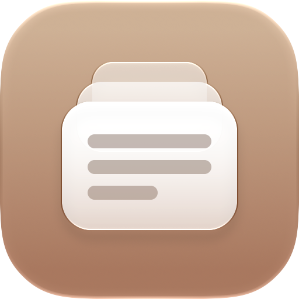
</p>

<h1 align="center">Encore</h1>

<p align="center">
  <strong>Everything you copy, ready for an encore.</strong><br>
  A native clipboard history for the macOS menu bar, with on-device Apple Intelligence.
</p>

---

Encore keeps everything you copy (text, images and files) one click away in the menu bar.
It's built with SwiftUI and AppKit for the macOS 26+ Liquid Glass design, it's fast, and it
stays out of the way. Long clippings get a short title written on your Mac by Apple
Intelligence, and any text clipping can be proofread, rewritten, summarized or explained
without leaving the menu bar.

Free and open source. No account, no subscription, no cloud.

<p align="center">
  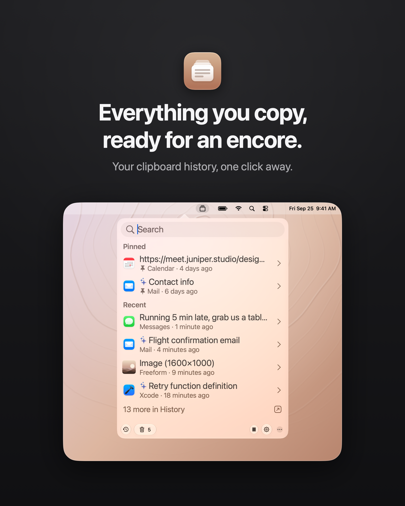
</p>

## Screenshots

<p align="center">
  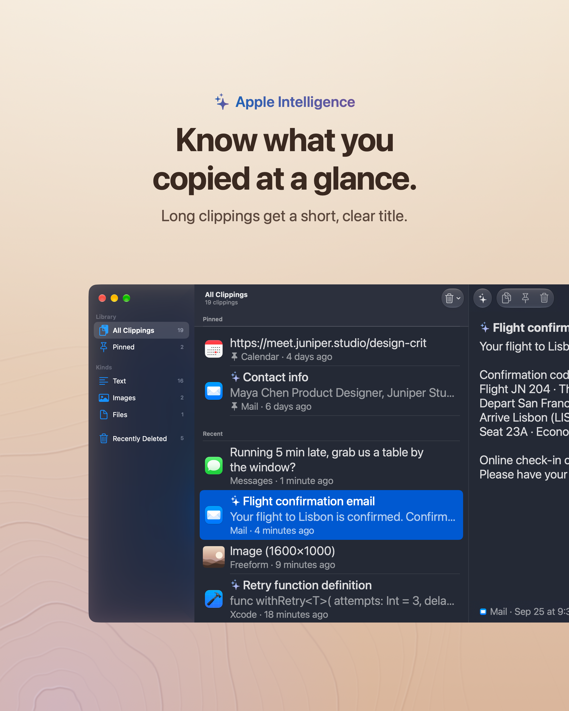
  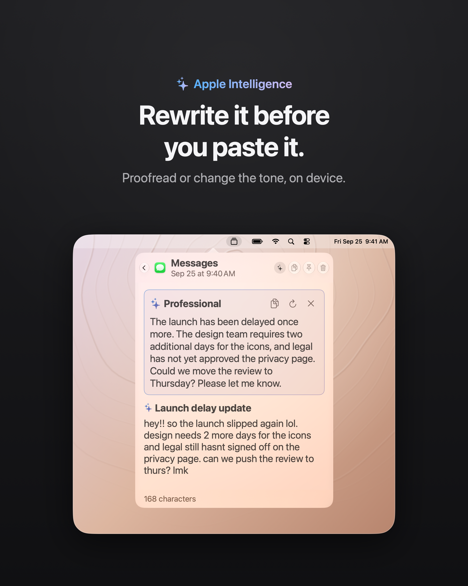
</p>

<p align="center">
  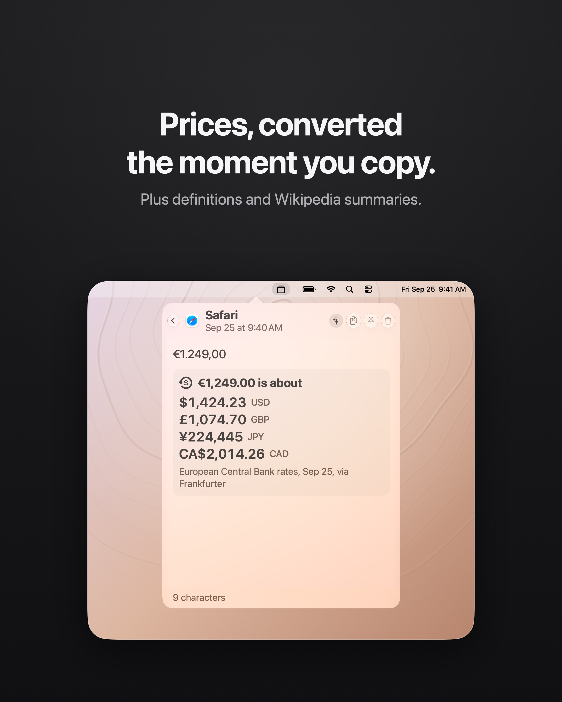
  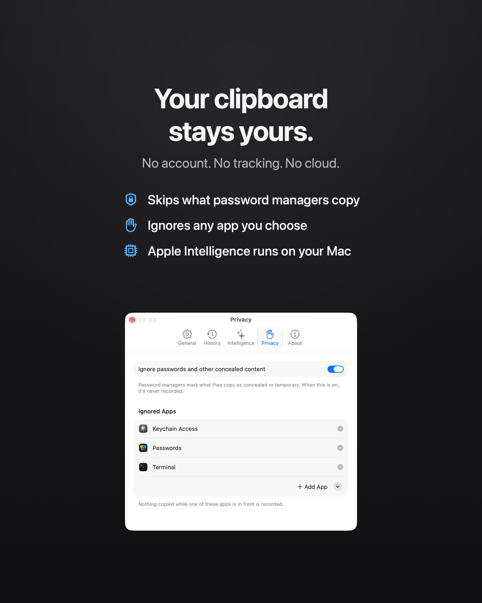
</p>

<p align="center">
  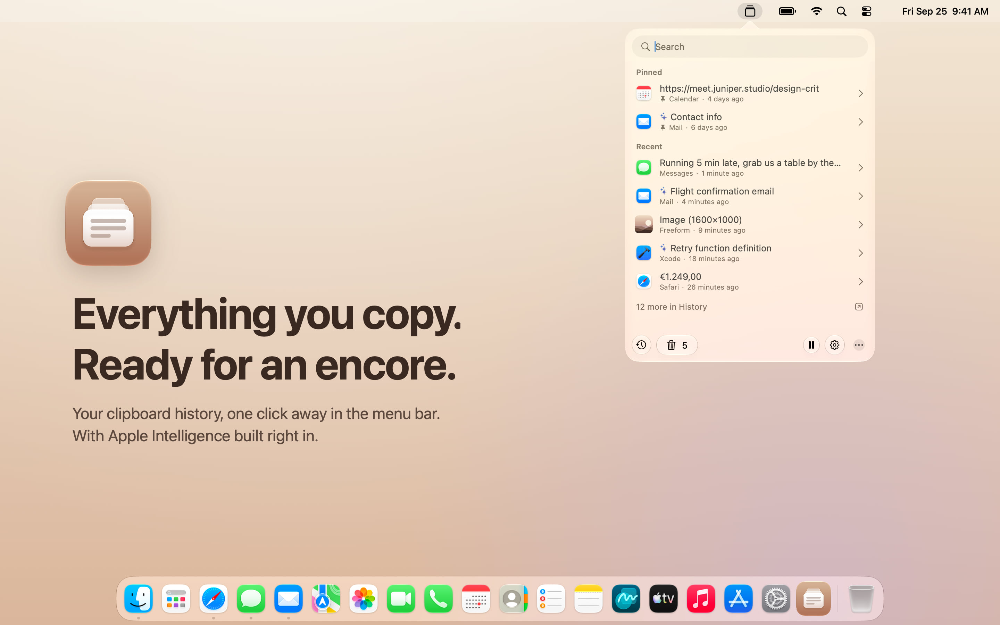
</p>

<p align="center">
  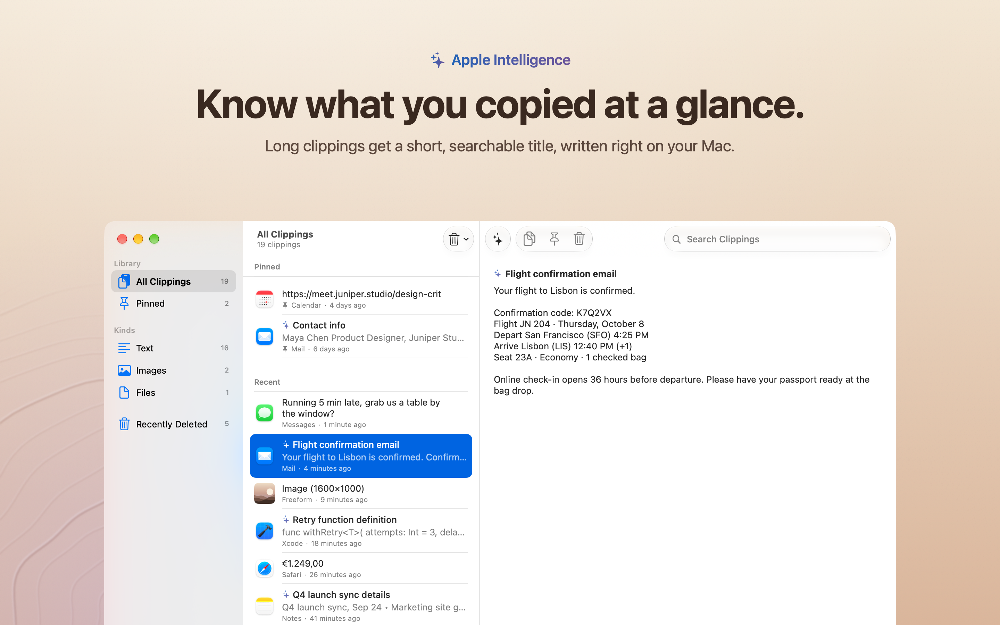
  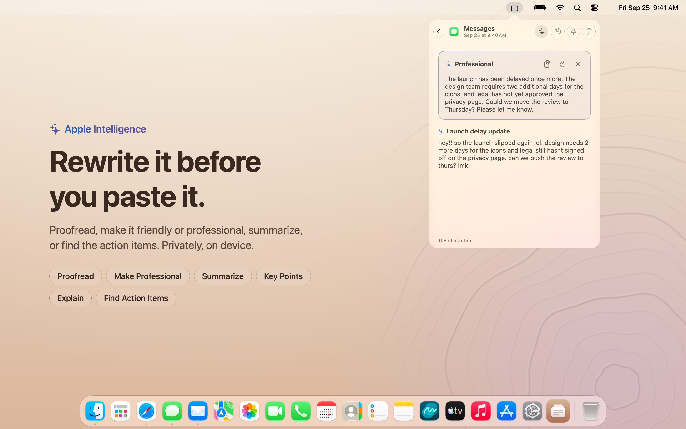
</p>

<p align="center">
  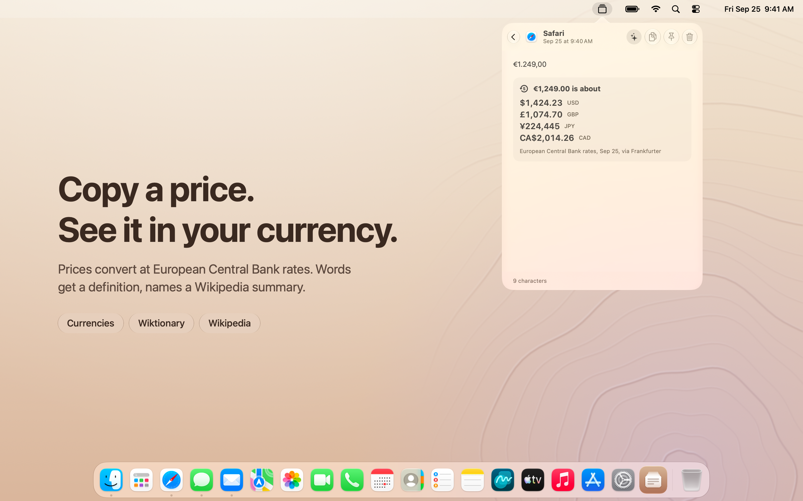
  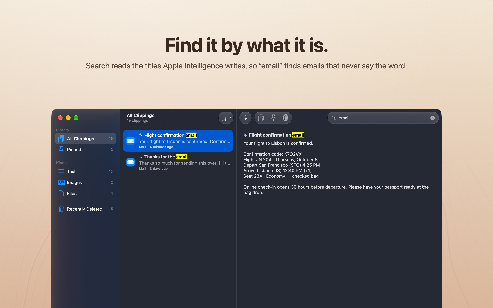
</p>

<p align="center">
  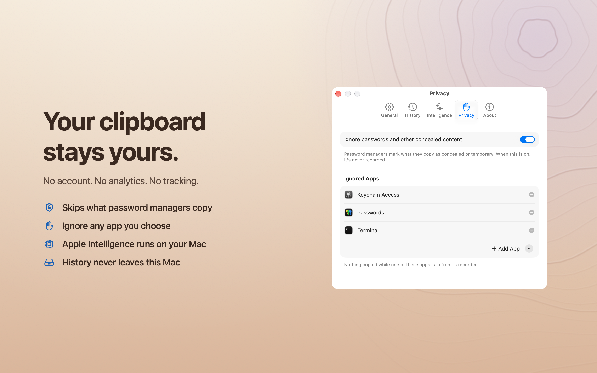
  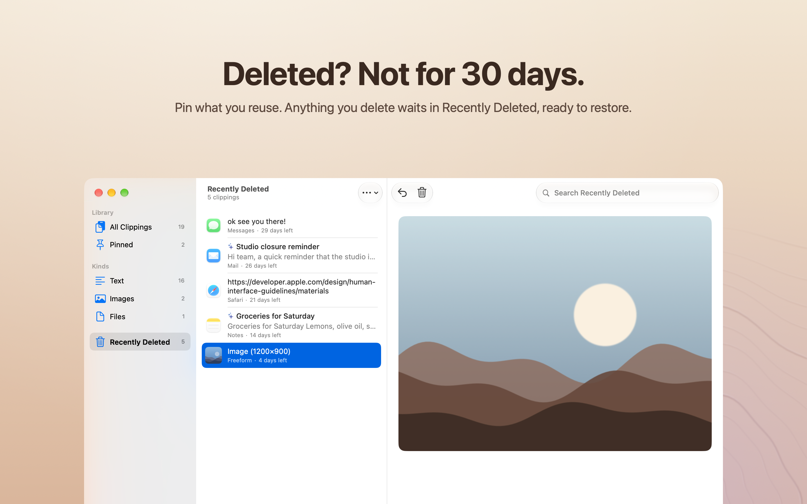
</p>

## Features

**Clipboard history**
- **Menu bar popover.** Click the icon for a searchable list of recent clippings. Click a
  row to copy it; the chevron opens the full clipping. Right-click the icon for a classic menu.
- **History window.** Sidebar (All, Pinned, Text, Images, Files, Recently Deleted), list and
  detail, with search, multi-select, context menus, swipe actions and keyboard commands
  (Return copies, ⌫ deletes, ⌘C copies, ⌘Z undoes).
- **Pin** what you reuse. Pinned clippings stay at the top and are never trimmed.
- **Recently Deleted.** Deleting is always recoverable for 30 days, with Undo right away.
- **No duplicates.** Copying something that's already in history moves it to the top.

**Apple Intelligence** (on device, requires an Apple Intelligence–capable Mac)
- **Smart titles.** Long clippings get a two-to-six-word title ("Flight confirmation email",
  "Python retry decorator"), written in the clipping's own language, so a long list can be
  scanned at a glance. Titles are searchable too.
- **Writing tools for any clipping.** The ✨ menu can *Proofread*, *Make Friendly*,
  *Make Professional* or *Make Concise*, and can *Summarize*, list *Key Points*, *Explain*
  (including code) or *Find Action Items*. Results stream in and can be copied with one click.

**Online lookups** (free services, no API keys)
- **Currency conversion.** Copy "$1,299.99", "€49,90" or "250 CHF" and see it in your own
  currency and other major ones, at European Central Bank rates via
  [Frankfurter](https://frankfurter.dev).
- **Definitions** from [Wiktionary](https://en.wiktionary.org) for a single word.
- **Encyclopedia summaries** from [Wikipedia](https://en.wikipedia.org) for a name or topic.

**Accessibility**
- **VoiceOver**: each clipping reads as one item with Copy, Pin, Show Details and Delete
  as actions; results are announced, and rotors jump to pinned clippings, images and files.
- **Voice Control**: every button has a speakable name.
- **Keyboard**: ↑ and ↓ in the popover, Return to copy, ⌘↓ to open a clipping.
- **Text Size** up to 200% (Settings → General, or ⌘+ and ⌘−).
- Follows Reduce Motion, Increase Contrast and Differentiate Without Color, with colours
  that meet Apple's contrast minimums.

## Privacy

Encore is built so your clipboard stays yours:

- History is stored only on your Mac, inside Encore's sandbox container
  (`~/Library/Containers/io.github.sudonicolas.encore/`). No account, no analytics, no
  crash reporting, no tracking: Encore collects no data at all.
- Apple Intelligence runs **entirely on device**. No clipping is ever sent to a server for
  titles or writing tools.
- Online lookups send **only what's needed, and only when needed**: a word or phrase goes to
  Wiktionary or Wikipedia only when you click *Define* or *Wikipedia*; exchange rates are
  fetched with just the currency code (never the amount or anything else you copied).
  Requests carry no cookies or identifiers. Lookups can be turned off in
  Settings → Intelligence.
- Anything password managers mark as concealed is never recorded, and you can exclude
  whole apps in Settings → Privacy.

The full policy is in [PRIVACY.md](PRIVACY.md).

## Requirements

- macOS 26 or later. Tested on macOS 27.
- For Apple Intelligence features: a Mac that supports Apple Intelligence, with it turned
  on in System Settings → Apple Intelligence & Siri. Everything else works on any Mac.

## Install

### From a release

1. Download `Encore.zip` from [Releases](https://github.com/sudonicolas/encore/releases),
   unzip it, and drag **Encore** to **Applications**.
2. The first time you open it, macOS may say it can't verify the developer, because
   Encore isn't notarized by Apple. Open **System Settings → Privacy & Security**, scroll
   down, and click **Open Anyway** next to the message about Encore.

### Build from source

Requires Xcode 26 or later.

```sh
git clone https://github.com/sudonicolas/encore.git
cd encore
./build.sh
ditto build/Encore.app /Applications/Encore.app
open /Applications/Encore.app
```

`build.sh` compiles a universal (Apple silicon and Intel) release build, assembles
`Encore.app` (with `LSUIElement` set, so it lives in the menu bar and not the Dock),
compiles the icon with `actool`, and signs the bundle with the same App Sandbox
entitlements as the store build. It signs with your Apple Development certificate if you
have one, so macOS doesn't ask about access to Encore's data after every rebuild, and
ad-hoc otherwise. For *Open at login* to work reliably, run Encore from a
stable location such as `/Applications`.

For quick iteration, `swift build` and `swift run` work too. They run the bare executable
rather than an app bundle, so there's no icon, no Dock hiding, no login item and no
sandbox. They also read and write `~/Library/Application Support/Encore/` instead of the
container, so they start with an empty history.

### Mac App Store build

`./build.sh --app-store` signs for distribution and produces `build/Encore.pkg` for
upload. See [docs/APP_STORE.md](docs/APP_STORE.md) for the one-time account setup and the
submission checklist.

### Clipboard permission

macOS lets you choose whether apps may read what other apps copy. If you set Encore to
**Deny** in System Settings → Privacy & Security → Paste from Other Apps, Encore can't
record anything and shows a banner to say so. Choose **Allow**.

### Upgrading from "clipboard"

Encore used to be called *clipboard*. On first launch it quits the old app if it's
running, moves your history and ignored apps into Encore's folder, and carries over your
settings. After that you can delete `clipboard.app`, and if it was set to open at login,
remove it from System Settings → General → Login Items and turn on *Open at login* in
Encore's Settings instead.

## Project layout

```
Sources/Encore/
  EncoreApp.swift                  App entry point (app menu commands)
  AppDelegate.swift                Status item, popover, History window, activation policy
  SettingsWindowController.swift   Toolbar-tab Settings window
  Models/                          Clipping, IgnoredApp, pasteboard read/write
  Stores/                          ClipboardStore (history, settings, persistence), AppNavigator
  Managers/                        Pasteboard polling, launch at login, migration from "clipboard"
  Intelligence/                    Foundation Models: availability, smart titles, writing tools
  Lookups/                         Currency, word and topic detection; Frankfurter, Wiktionary
                                   and Wikipedia clients; lookup cards
  Views/                           Popover, History window, Recently Deleted, Settings panes
  Utilities/                       App info, brand and status colours, corner radii, thumbnails,
                                   highlighting, Text Size, accessibility helpers
Resources/AppIcon.icon             The app icon, an Icon Composer document
Resources/PrivacyInfo.xcprivacy    Privacy manifest (no tracking, no data collected)
Resources/container-migration.plist  Moves pre-sandbox data into the container
Encore.entitlements                App Sandbox entitlements
tools/export-icon-preview.sh       Renders the icon to docs/icon.png
```

The icon is a layered Liquid Glass design. Open `Resources/AppIcon.icon` in Icon Composer
(bundled with Xcode) to edit it; macOS renders it live in light, dark, clear and tinted
appearances.

## Notes

- Clipboard changes are detected by polling `NSPasteboard.changeCount` twice a second, since
  macOS has no notification for pasteboard changes. This is the standard approach for
  clipboard managers.
- While the History or Settings window is open, Encore behaves like a regular app (Dock
  icon, ⌘Tab). It goes back to menu bar only when they close.
- Sandboxed, with only outgoing network access (for online lookups) and read-only access
  to apps you choose in Settings → Privacy. Builds from before sandboxing kept their data
  in `~/Library/Application Support/Encore/`; `Resources/container-migration.plist` makes
  macOS move it into the container on first launch.
- There's no global keyboard shortcut to open the popover yet.

## License

[MIT](LICENSE) © 2026 sudonicolas
